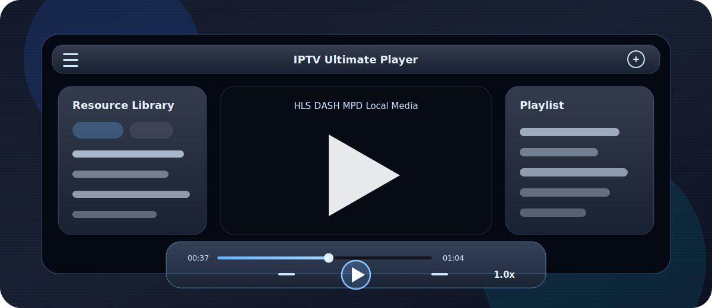
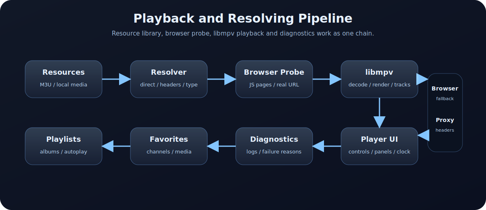

# IPTV Ultimate Player 📺

[中文](README.md) | [English](readme_en.MD)




🚀 **项目宣传页**：可直接打开 [docs/index.html](docs/index.html)，或在 GitHub Pages 中将 `docs/` 作为发布目录。

📺 **IPTV Ultimate Player** 是一个基于 **PySide6 + libmpv** 的 Windows 桌面 IPTV/本地媒体播放器。它把直播源管理、本地媒体播放、网页嗅探解析、浏览器播放、收藏管理、播放列表和现代化播放器界面整合到一个可持续演进的工具里。

🎯 项目目标不是再做一个普通播放器，而是面向复杂直播源和本地媒体库场景，提供一个可诊断、可扩展、可打包发布的桌面播放平台。

> 🚧 当前项目仍处于快速迭代阶段，适合个人使用、二次开发和功能验证。复杂直播源的可用性会受到源站策略、地区网络、Token 时效、DRM、Referer/User-Agent、浏览器兼容性等因素影响。

## ✨ 亮点

| 能力 | 说明 |
| --- | --- |
| 📡 直播和本地双模式 | 同时支持 IPTV 频道资源和本地视频、音频、GIF、图片资源。 |
| 🎬 libmpv 播放核心 | 借助 mpv/libmpv 的格式兼容性、硬解能力和高质量渲染能力。 |
| 🧭 浏览器辅助解析 | 对需要 JavaScript、点击播放或页面触发后才生成真实流地址的网站，提供嗅探和解析链路。 |
| ⭐ 收藏和播放列表 | 支持资源收藏、频道收藏、本地播放专辑、自动连播、跳过片头片尾。 |
| 🪟 现代化 UI | Apple TV 风格玻璃拟态控制栏，工具栏、顶部条、资源库、播放列表面板统一色调。 |
| 🧪 诊断友好 | 对 HTTP 不可用、嗅探超时、mpv 403/404、CENC 解密失败等问题做失败分类和日志记录。 |
| 📦 可发布安装包 | 已提供 GitHub Actions 工作流，可在 Windows runner 上构建安装包并发布 Release。 |

## 功能详解

### 直播播放

- 支持常见频道资源文件：`M3U`、`M3U8`、`TXT`、`JSON`、`CFG`。
- 支持常见直播格式：`HLS/M3U8`、`DASH/MPD`、`FLV`、`TS`。
- 支持频道分组、频道列表、频道详情、频道收藏。
- 支持从频道列表、频道收藏、资源面板等不同入口进入播放。
- 支持播放控制栏上的上一个/下一个，并根据当前播放来源自动选择切换范围。
- 支持默认浏览器观看和选择浏览器观看，方便对比 libmpv 与浏览器播放差异。

### 智能解析与诊断

- 对直接可播放的流地址优先走快速解析。
- 对需要网页触发的播放页，提供浏览器嗅探能力，尝试捕获真实媒体地址。
- 支持配置探测超时时长、代理、浏览器端口等参数。
- 支持解析失败原因分类，帮助定位：
  - HTTP 不可用
  - 嗅探超时
  - 找到源但 libmpv 返回 403/404
  - CENC/DRM 解密失败
  - 页面播放器报错但未暴露可播放媒体
- 每次启动生成独立日志文件，方便复盘问题。

### 本地媒体播放

- 支持 libmpv 可播放的本地视频格式，例如 `mp4`、`mkv`、`mov`、`avi`、`flv`、`ts` 等。
- 支持音频、GIF、图片等本地资源类型。
- 支持本地渲染模式：流畅优先、画质优先、极致画质。
- 支持播放/暂停、停止、进度拖动、音量、全屏、倍率播放。
- 支持播放结束后再次点击播放按钮重新播放当前资源。
- 资源库面板支持筛选和搜索，长文件名自动省略，收藏按钮保持可见。

### 收藏管理

- 资源收藏管理器：
  - 支持收藏频道资源、视频、音频、GIF、图片。
  - 支持查看、播放、删除收藏关联。
  - 删除收藏不会删除原始资源文件。
  - 自动检测本地资源是否仍然存在，并标注失效资源。
  - 支持类型筛选和搜索。
- 频道收藏管理器：
  - 收藏单个频道，而不是整个频道文件。
  - 支持查看、播放、删除频道收藏关联。
  - 保留频道类型、播放地址、请求头、台标、EPG 标识等关键快照信息。
  - 支持搜索和失效提示。

### 播放列表

- 仅面向本地播放场景。
- 支持多个播放专辑。
- 可通过文件夹创建新专辑，并将该文件夹下的媒体加入专辑。
- 支持专辑持久化保存。
- 支持专辑级设置：
  - 是否自动连播
  - 是否跳过片头
  - 片头时长
  - 是否跳过片尾
  - 片尾时长
- 鼠标移动到界面右边缘时滑入播放列表面板。
- 双击文件播放或一段时间无操作后，播放列表面板自动滑出。

### 交互和界面

- 使用 PySide6 QWidget 实现，不依赖 QML。
- 播放控制栏采用深色玻璃拟态风格，带蓝色辉光、渐变背景和自绘图标。
- 工具栏、播放顶部条、资源库面板、播放列表面板和设置面板保持统一视觉语言。
- 播放状态下支持顶部条菜单、频道详情、节目单、停止播放、全屏等操作。
- 支持悬浮时钟、星期显示、立体化和悬浮效果。
- 支持中英文界面切换基础，便于未来扩展更多语言。

## 播放链路



## 运行环境

- Windows 10/11
- Python 3.12+ 推荐
- PySide6
- libmpv

项目默认从以下位置加载 libmpv：

```text
plugins/Mpv/libmpv-2.dll
```

如果你自行构建或重新整理仓库，请确认 `plugins/Mpv` 下存在可用的 libmpv 运行文件。

## 快速开始

1. 克隆项目：

```powershell
git clone https://github.com/<your-name>/<your-repo>.git
cd <your-repo>
```

2. 创建虚拟环境：

```powershell
python -m venv .venv
.\.venv\Scripts\Activate.ps1
```

3. 安装依赖：

```powershell
pip install -r requirements.txt
```

4. 启动：

```powershell
python main.py
```

也可以运行：

```powershell
.\start.bat
```

## 推荐使用方式

1. 将频道文件或本地媒体目录放入 `Channels/`，或在界面中选择资源目录。
2. 通过资源库面板加载资源目录。
3. 双击频道或媒体资源开始播放。
4. 鼠标移动到左边缘打开资源库或频道列表，移动到右边缘打开播放列表。
5. 在设置面板中调整代理、探测超时、浏览器端口、渲染模式、语言等参数。
6. 遇到复杂源播放失败时查看 `logs/` 下最新日志。

## 目录说明

```text
backend/        解析、代理、EPG、收藏、播放列表等后端逻辑
frontend/       浏览器播放页模板
i18n/           多语言资源
models/         Qt Model/ProxyModel
plugins/        libmpv 等运行时插件
ui/             PySide6 界面组件
utils/          设置、诊断、媒体类型等工具模块
widevine/       可选 Widevine 相关说明或运行时文件
main.py         应用入口
pyside_main.py  启动、日志、QtWebEngine/libmpv 运行时配置
```

运行时会自动生成或使用：

```text
Channels/       频道资源与本地资源目录
EPGs/           节目单缓存
config/         应用设置、收藏、播放列表
logs/           每次启动生成的日志文件
```

这些运行数据通常不建议提交到 GitHub，项目已通过 `.gitignore` 默认忽略。

## GitHub Actions 打包

项目已提供 Windows 安装包构建工作流：

```text
.github/workflows/windows-installer.yml
```

工作流会：

1. 在 `windows-latest` 环境安装 Python。
2. 安装项目依赖和 PyInstaller。
3. 使用 PyInstaller 构建 one-dir Windows 应用。
4. 使用 Inno Setup 生成 `.exe` 安装包。
5. 将安装包作为 Artifact 上传。
6. 推送 `v*` 标签时自动创建 GitHub Release 并附加安装包。

发布示例：

```powershell
git tag v0.1.0
git push origin v0.1.0
```

## 合规说明

- 本项目采用 **GNU General Public License v3.0 or later**（`GPL-3.0-or-later`），详见 [LICENSE](LICENSE)。
- 选择 GPL-3.0-or-later 的主要原因是项目核心播放能力依赖 libmpv。
- 分发安装包时，请同时保留并遵循 libmpv/mpv、Qt/PySide6、FFmpeg 以及其他第三方组件的许可证要求。
- 直播源仅用于合法授权内容播放，请遵守当地法律法规和源站服务条款。
- DRM/Widevine 内容的可播放性取决于本机环境、授权方式和源站策略。
- 浏览器嗅探功能只用于解析用户可访问页面中的可播放媒体地址，不保证所有网站可用。

## 开发建议

- 保持 UI 层和播放/解析逻辑解耦。
- 复杂功能先补需求方案文档，再实现。
- 涉及复杂源解析时，保留诊断日志和失败分类。
- 面向发布时，优先保持依赖、许可证、运行时文件和打包脚本可追溯。
